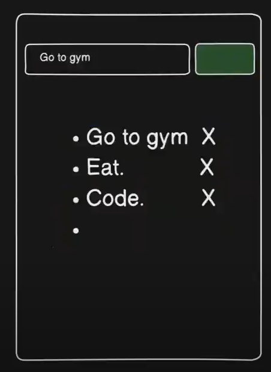

### Todo App

## Wireframe

## Functionality

- **Add Task:** Users can add a task by typing in the textbox and clicking the 'Add' button.
- **Delete Task:** Users can delete individual tasks by clicking the 'Delete' button next to the task.
- **Clear All Tasks:** Users can clear the entire list of tasks by clicking the 'Delete All' button.